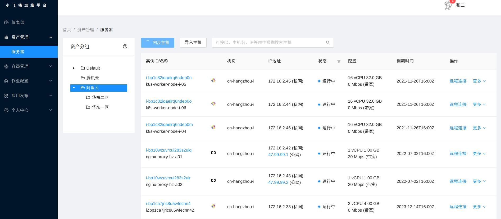
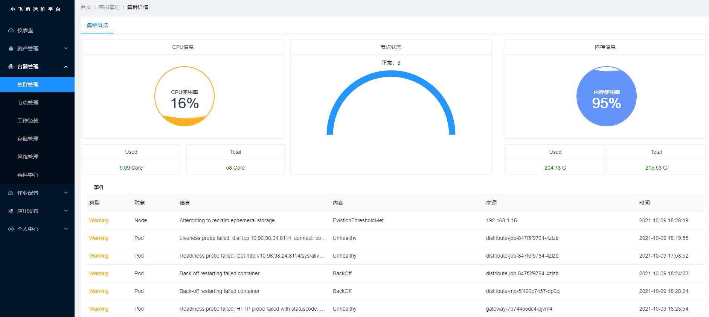
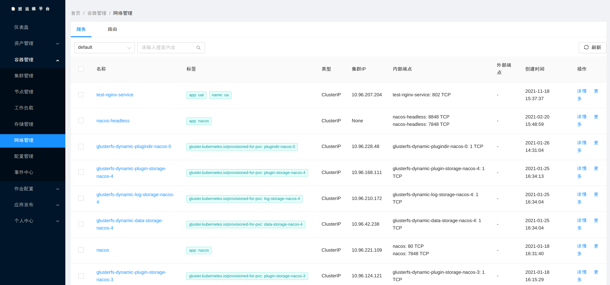

## 项目简介

<p align="center">
  <a href="https://golang.google.cn/">
    
  </a>
  <a href="https://gin-gonic.com/">
    
  </a>
  <a href="https://gorm.io/">
    
  </a>
  <a href="https://redis.io/">
    
  </a>
  <a href="https://vuejs.org/">
    
  </a>
  <a href="https://antdv.com/docs/vue/introduce-cn/">
    
  </a>
</p>

> KubeSpace运维平台， 本项目使用Go1.15.x、 Gin、Gorm开发， 前端使用的是Vue3+Ant Design2.2.x框架。


## 使用说明
1. 安装编译
```shell script
# 拉取代码
git clone git@github.com:foce123/kubespace.git

# 打包
cd kubespace
go build main.go -o ./luban
or windows
GOOS=windows GOARCH=amd64 go build main.go ./luban

# 启动
./luban

# 启动前端
cd kubespace/luban_fe
npm run dev
```

2. 启动服务前先创建etc/config.yaml
```shell script
# 数据库配置
mysql:
  path: '127.0.0.1:3306'
  db-name: 'kubespace'
  username: 'root'
  password: '123456'
```

3. 初始化数据库
```go
windows执行以下脚本, 初始化数据库

init_db.sh # or init_db.bat
```

#### 目前已经实现的功能
* 用户登录
  * LDAP/Email
  * 钉钉扫码登录(开源版暂未开放)
* 权限管理
* 用户注册登录
  * [如何配置LDAP](.)
  * [配置钉钉扫码](.)
- K8S多集群管理
  * [集群管理](.)
  * [节点管理](.)
  * [工作负载](.)
  * [存储管理](.)
  * [网络管理](.)
  * [配置管理](.)

- 资产管理
  * [远程连接](.)


## 首页


## 仪表盘


## 资产管理


## 远程连接


## 集群管理


## 集群详情


## 节点列表


## 网络管理


## 存储管理


## Roadmap

> [历史版本详情](./docs/version/README.md)
> 

- 应用发布(分批发布、版本回退)

- 作业系统
- 审批流

## License
Everything is Apache License 2.0.

